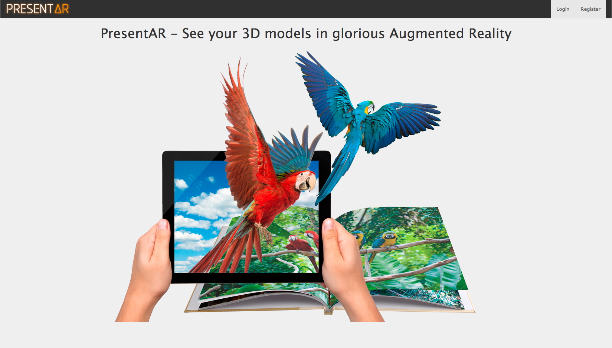
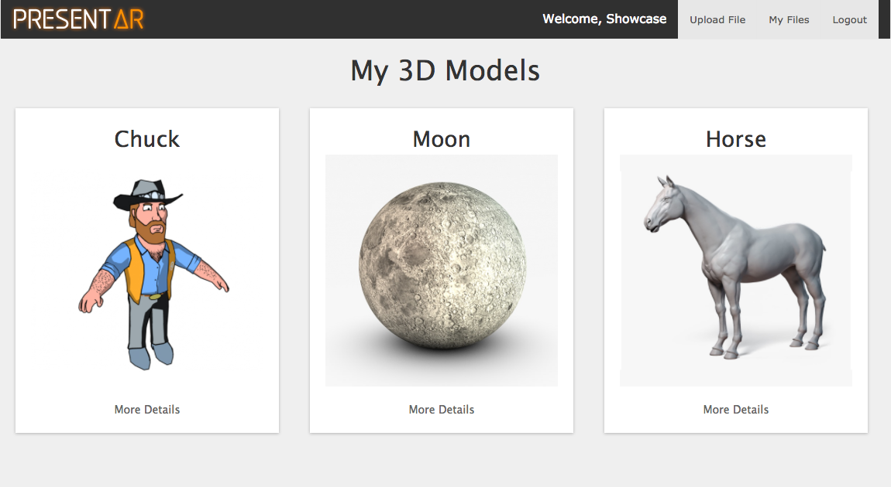
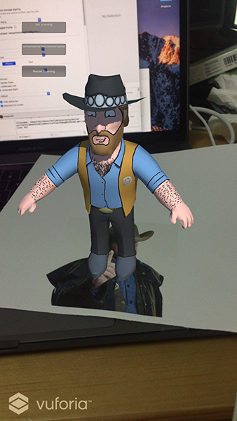

<h1 align="center">
  PresentAR (Website)
</h1>

<h4 align="center">The website component of PresentAR.</h4>



What is PresentAR?
----
#### An augmented reality presentation aid.   
PresentAR allows you to harness the power of AR, and display 3D models which can be manipulated in real-time, wherever you are. 3D models and their associated Image Targets are uploaded to [the companion website](https://presentar.herokuapp.com/) and can then be accessed through this client app. 

The Image Targets are recognised using Vuforia Cloud Recognition and the 3D models are downloaded on-the-fly in the app using the AWS link stored in the image target metadata. This allows the user to add new models and image targets without having to interact directly with either Unity or the Vuforia Developer Portal.


The repository for the companion mobile App is available [here](https://github.com/mengchenwang/presentAR-client).

Technologies used
----
#### Build:
- Ruby on Rails, HTML
#### Database:
- PostgreSQL
#### Styling:
- Bootstrap and SCSS

How to set up the application
----
```
$ git clone https://github.com/mengchenwang/presentAR.git
$ cd presentAR
$ bundle
$ rake db:setup
$ bin/rails db:migrate
$ rspec
$ bin/rails server
```
Tested using:
----
- RSpec
- Capybara

How to run tests
----
```sh
$ cd presentAR
$ rspec
```

Authors
----
Zoë Hopkins, Luan van Pletsen, James Stubbs, Mengchen Wang
